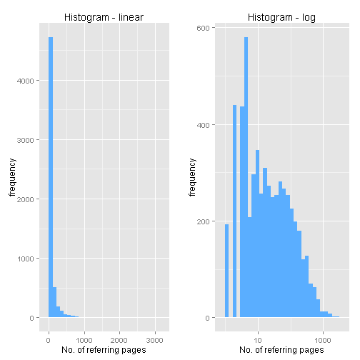

### Introduction
&nbsp;  
Following up references for a certain topic is a measure of importance.  
Reference crosslinking is a major field of network studies.  
&nbsp;  
&nbsp;  
Wikipath application allows you to access Wikipedia referencing information.
- Extracts the number of references to any Wikipedia article
- Extracts references to random Wikipedia articles
- Plots the number of references on a histogram

--- .codefont .codemargin
### Assessing references for a single article
  
- You can submit any expression to get if it is referenced - the application returns the number 
of references.  
- The application uses the "Special:WhatLinksHere" function of Wikipedia which 
lists the referring Wikipedia pages to the selected article.  
  

  
The main function:    
  

  
Result for "coursera" is: 130.  
Result for "io2012" is: 'io2012' article does not exist on Wikipedia..  

--- .codefont .codemargin .outmargin
### Random articles
Random Wikipedia articles are obtained by the "Special:Random" Wikipedia function.  
- You can specify the number of random runs
- The app obtains the number of referring pages for each
- The app stores the name of the randomly selected articles
- Finally, it plots the results on a googleVis histogram

---
### Histogram of reference numbers to 5699 random Wikipedia articles

 

